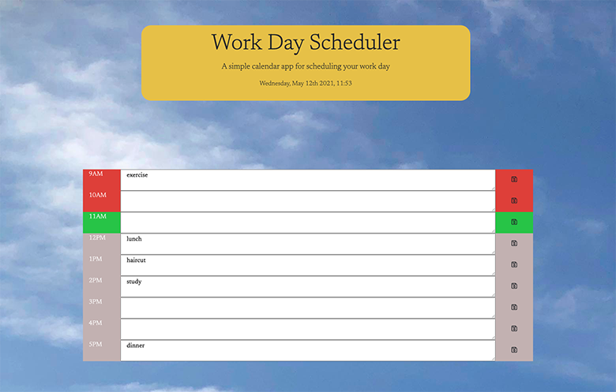

<h1 align="center">Work Day Scheduler 🖊️ </h1>

### 🏠 https://crenauro.github.io/Workday-Scheduler/

 

# Install

Open the above link in your browser.
 
 

# Usage

Each time block is color coded to note whether it is in the past, present or future. When a timeblock is clicked,
an event can be entered and saved in local storage by clicking on the save icon at the end of the row.
When the page is refreshed the saved events persist.

 
 

## Description

This app uses HTML, CSS, the Moment.js library to get the local time and saves the data to local storage.

## Credits

Thank you to my tutor and AskBCS. Background photo is my own.
